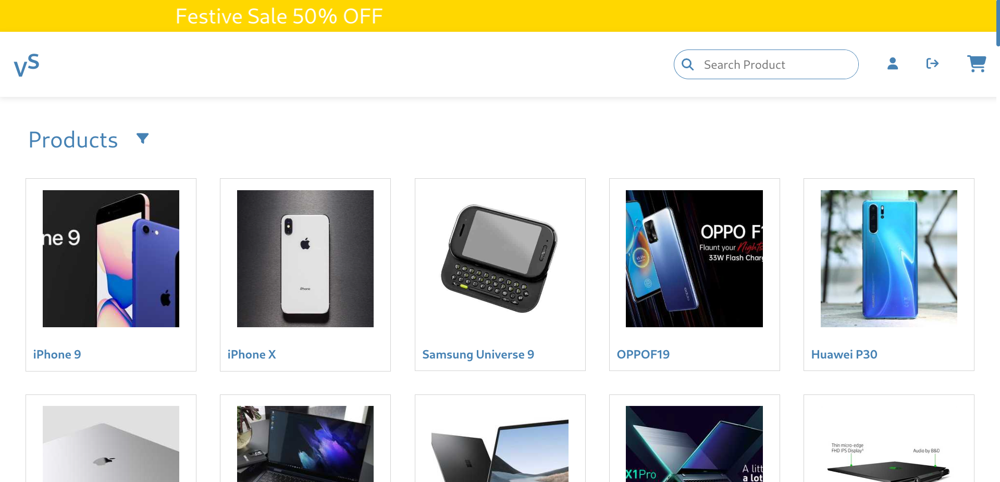

# E-Commerce Project

Welcome to this full-stack e-commerce project! The platform is crafted using the powerful MERN stack (MongoDB, Express.js, React, Node.js). The goal is to deliver a seamless shopping experience with a range of features, ensuring a user-friendly and secure environment.



### Key Features

- **User Authentication with JWT**: Securely register, log in, and manage your account with JSON Web Tokens.
- **Search Bar**: Quickly locate your desired items using our search bar for a hassle-free shopping experience.
- **Product Filtering**: Easily find products with our efficient product filtering system.
- **Cart Items Display**: Browse and add products to your cart, with a real-time display of your selected items.
- **Checkout Functionality**: Experience a smooth checkout process with a convenient "Proceed to Pay" option.
- **Stripe Integration**: The platform features integrated Stripe for a secure and efficient payment gateway, ensuring your transactions are safe.
- **Orders List**: Keep track of your order history and view details of your past purchases.

## Usage

- **Login or Register**: Existing users can log in to access the homepage. New users should register to create an account.

- **Browse and Select Products**: Explore a variety of products on the homepage. Utilize product filtering options and the search bar for a quick selection.

- **Add to Cart**: Add your chosen products to the cart.

- **Checkout**: Proceed to checkout to review your selected items.

- **Payment with Stripe**: Complete the payment securely through our integrated Stripe payment gateway.

- **Order History**: After successful payment, view your order history in your profile.

## Installation

### Frontend

1. Clone the frontend repository:

   ```bash
   git clone https://github.com/venkatasai24/Ecommerce.git
   cd Ecommerce
   ```

2. Install dependencies:

   ```bash
   npm install
   ```

3. Configure the environment variables and server connection.

4. Start the frontend server:

   ```bash
   npm start
   ```

### Backend

1. Clone the backend repository:

   ```bash
   git clone https://github.com/venkatasai24/Ecommerce-Backend.git
   cd Ecommerce-Backend
   ```

2. Install dependencies:

   ```bash
   npm install
   ```

3. Configure the environment variables, client connection and database connection.

4. Start the backend server:

   ```bash
   node index.js
   ```

## Tech Stack

- **MongoDB**: Database for storing user and order information.
- **Express.js**: Backend framework for building the API.
- **React**: Frontend library for building the user interface.
- **Node.js**: Server-side runtime for running the backend.
- **JSON Web Tokens (JWT)**: Used for user authentication.
- **Stripe**: Payment gateway for processing transactions.

## Contributing

Contributions are always welcome! If you'd like to contribute to the project, please follow these steps:

1. Fork the repository.
2. Create a new branch for your feature or fix:
   ```bash
   git checkout -b feature/your-feature
   ```
3. Commit your changes and push to your fork:
   ```bash
   git commit -m 'Add some feature'
   git push origin feature/your-feature
   ```
4. Create a pull request on the original repository's `main` branch.

## License

This project is licensed under the MIT License - see the [LICENSE.md](./LICENSE.md) file for details.
